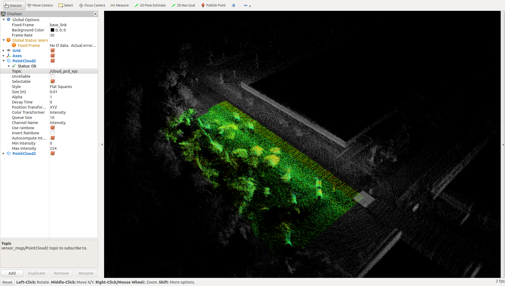

# pcl_common


## pcl_passthrough

```bash
roslaunch pcl_common pcl_passthrough.launch filename:=<.pcd> interval:=<default:1>
```

pcdの範囲選択を簡易的に行うやつ

* rviz
rvizを立ち上げて，`config`フォルダ内のpcl_passthrough.rvizを開く
* Dynamic Reconfigure
rqtのDynamic Reconfigureを立ち上げて，`config`フォルダ内のpcl_passthrough.yamlを開く．



参考：
[http://library.isr.ist.utl.pt/docs/roswiki/pcl_ros.html](http://library.isr.ist.utl.pt/docs/roswiki/pcl_ros.html)
[http://wiki.ros.org/pcl_ros/Tutorials/PassThrough%20filtering](http://wiki.ros.org/pcl_ros/Tutorials/PassThrough%20filtering)

## pointcloud_to_pcd

範囲選択したデータを`~/.ros`フォルダに保存する．

```bash
roslaunch pcl_common pointcloud_to_pcd.launch
```

**設定**

PointCloud2トピック
```xml
<remap from="/input" to="/cloud_pcd_xyz"/>
```


## ndt_mapping

```bash
roslaunch pcl_common ndt_mapping.launch
```

**設定**  
```xml
<param name="max_iter" type="double" value="30" />
<param name="ndt_res" type="double" value="1.0" />
<param name="step_size" type="double" value="0.1" />
<param name="trans_eps" type="double" value="0.01" />
<param name="leaf_size" type="double" value="0.5" />
<param name="map_leaf_size" type="double" value="0.02" />
<param name="min_scan_range" type="double" value="3.0" />
<param name="min_add_scan_shift" type="double" value="0.5" />
<param name="base_link_" type="string" value="map" />
<param name="current_frame_" type="string" value="velodyne" />
<!-- <param name="sub_name" type="string" value="/hokuyo3d/hokuyo_cloud2" /> -->
<param name="sub_name" type="string" value="/velodyne_points" />
```

## bounding_box

任意の最小・最大の点からBoundingBoxを表示する

## pointcloud_to_pcd

`pointcloud2`から`pcd`ファイルに保存する

```bash
roslaunch pcl_common pointcloud_to_pcd.launch
```

**設定**

```xml
<remap from="input" to="orb/point_cloud2" />
<param name="fixed_frame" type="string" value="velodyne" />
```

`fixed_frame`を設定することで，その座標から見た点群で保存できる．


